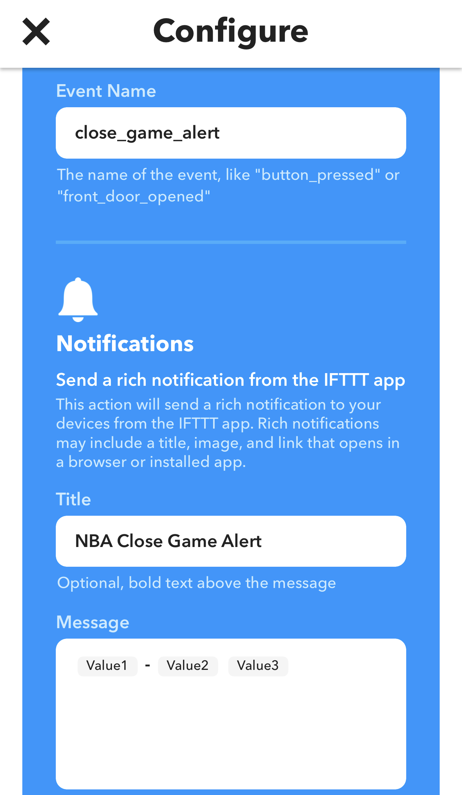

NBA IFTTT Close Game Alert
====

Python script to send an IFTTT notification for NBA close game situations.

Run as a cron job and linked to MongoDB to keep track of notification status.


Dockerfile
----
```docker
ENV BASKETBALL_DB ''
ENV MAKER_URL ''
```

close_game.py
----
```python
# default constraints for close game situation
CONFIG = {
    'pt_differential': 10,
    'mins_left': 6,
    'period': 4
}
```

Build and run commands:
---
```bash
docker build -t basketball-notifier ./
docker run -it --rm basketball-notifier
```

cron command
----
```bash
$(which docker) * * * * * run --rm basketball-notifier
```

<hr />

IFTTT Webhook Configuration
----


<hr />

Notification Example
----
